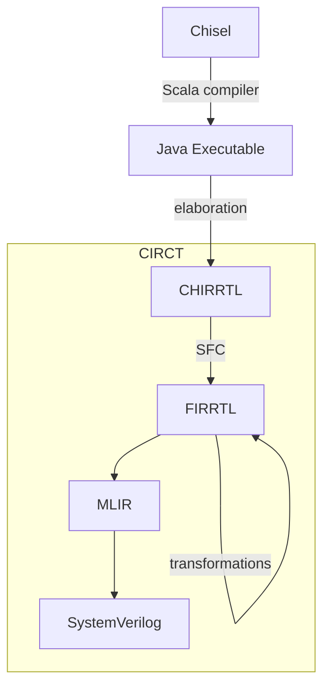

# Rewrite FPROSoC in Chisel

## Chisel

Chisel is technically not a new language but a library written in and for Scala, more exactly it is domain specific language (DSL) for describing hardware circuits embedded in Scala, but given it's extensions it provides on top of Scala it's often described as open-source hardware description language.

### Hardware construction language

In the early days, scripting languages like Perl and Python were used to generate VHDL/Verilog code (sometimes from excel spreadsheets), but the problem with such generators were that they worked on strings, without real understanding (typification) of ingested/generated code. SystemVerilog tried to migrate the this by offering some generational constructs (`#(parameter N=4)`, `generate`) and even some high level constructs like classes that are only available for verification (are typically not synthesizable).

Chisel is actually hardware construction language, that allows us to write hardware generators instead of describing hardware directly. Because it uses Scala each module can be parametrized as any Scala class (using various parameters and generics) and then use those arguments for "generation" using Scala loops or even higher order functions. To understand how and why this works, we will take a look in Chisel to Verilog compilation.

### Chisel to Verilog



#### Compilation

Chisel gets compiled (as Scala) to JVM, which is then executed (this is usually done by `sbt run` command).

#### Elaboration

Is execution on Chisel compiled program, which during construction of `Top` class (and it's subsequent classes) add hardware AST (CHIRRTL) to `ChiselStage`. Each `Module` class gets compiled separately (and it will get lowered into separate SystemVerilog module). Other classes are inlined into first parent `Module` class. This part does hardware generation, from parametrized constructs to concrete hardware AST (modules). Each iteration of loops just adds more hardware AST nodes to stage.

#### Circuit IR Compilers and Tools

Scala FIRRTL (SFC) lowers CHIRRTL to FIRRTL, on which FIRRTL compilers apply some transformations (optimizations; ex: for unused signals) and lower it to MLIR that get optimized further and compiled into targeted language (usually SystemVerilog).

## Design flow in Chisel

Chisel is board independent, it generates SystemVerilog that is later to be consumed by other FPGA tools (in our case Vivaldo) to generate bitstream for board.

Firstly, I imported all files from vaja6 into template Chisel tree (under resource directory), this way all sources are in one place (single source of truth). Secondly, I created `BlackBox` for Top.sv file. `BlackBox` are like header files in C, they only define interface/signature not actual implementation and are not type checked (mismatch between Verilog and Chisel `BlackBox` will cause error in simulation/synthesis if you are lucky). Lastly I setup `ChiselStage` to emit SystemVerilog files into target_sv directory.

```scala
class Top extends BlackBox with HasBlackBoxResource {
  val io = IO(new Bundle {
    val clock = Input(Clock())
    val reset = Input(Reset())
    val sw = Input(UInt(16.W))
    val led = Output(UInt(16.W))
    val anode_assert = Output(UInt(8.W))
    val segs = Output(UInt(7.W))
  })
  // will copy resource files into target_sv
  addResource("/top.sv")
  addResource("/mcs_bridge.sv")
  addResource("/mmio_controller.sv")
  addResource("/mmio_cores.sv")
  addResource("/mmio_subsystem.sv")
}

object Top extends App {
  ChiselStage.emitSystemVerilogFile(
    new Top,
    Array("--split-verilog", "--target-dir", "target_sv/"),
    firtoolOpts = Array("-disable-all-randomization", "-strip-debug-info")
  )
}
```

Now if we run `sbt run` Chisel/Scala gets compiled, elaborated and lowered into SystemVerilog files that are located in target_sv. This folder can now be loaded into vivaldo project as sources folder (make sure that "copy to project" is not checked). Then we simply associate ELF file and generate bitstream and test on the board.

Using top-down approach we can incrementally rewrite Modules into Chisel and/or blackbox them. Then regenerate bitstream and retest, this way we know we did not break anything in this step of rewriting. We can also write tests in Chisel for modules to ensure no behavior changes (it make sense to write test for blackboxes and later when doing rewrite we expect that tests will still pass). Test are run using `sbt test` and they require verilator to be installed (WSL on Windows).

For `Top` class we need to change it from `BlackBox` to `Module`, then create blackboxes for all of it's children (`microblaze_mcs_0`, `mcs_bridge`, `mmio_subsystem`) and write actual Chisel implementation of `Top` (which is mostly just connecting wires between it's children) and finally remove Top.sv file from resources.

## Verilog -> Chisel

no support for subword assignments, always need to use cat

no concept of logic (typified) you need reg or wire

### init

| verilog | chisel |
|---------|--------|
| `logic a;` | / |
|`wire a;`| `val a = Wire(/*type*/)`|
|`reg a;`| `val a = Reg(/*type*/)`|
|| `val a = RegInit(r.U(w.W))`|
|| `val a = RegNext(/*TODO*/)`|

### slices

| verilog | chisel |
|---------|--------|
| `a[15]` | `a(15)`|
|`a[32:16]`| `a(32,16)`|

## Known chisel problems

- in verilog: `input  [15:0] sw` in chisel: `val led = Output(UInt(16.W))` not `val led = Output(UInt(15.W))`
- bad docs
- unpacked array not supported, but we can use [packed arrays](https://verificationguide.com/systemverilog/systemverilog-packed-and-unpacked-array/) that only require magic options (again bad docs) `scalarize-ext-modules`
- sizes are not really typed (they are checked in lowering)

not bug but a feature: all wires need to be connected, one can use `DontCare`

## Know Vivaldo problems

- associate ELF does not work correctly if MCS is not in top module
- vivaldo does not check folder for new files so folder needs to be reimported7
- sometimes changes are not detected (generate bitstream uses old files)

### Sources

- <https://www.researchgate.net/publication/383664706_Hardware_Generators_with_Chisel>
- <https://circt.llvm.org/>
- <https://stackoverflow.com/questions/44548198/chisel-code-transformation>
- <https://chipyard.readthedocs.io/en/stable/Tools/index.html>
- <https://chipyard.readthedocs.io/en/stable/Customization/Firrtl-Transforms.html>
- Schoeberl, M. (2019). Digital Design with Chisel. Kindle Direct Publishing
- <https://github.com/freechipsproject/chisel-bootcamp>
- <https://en.wikipedia.org/wiki/SystemVerilog>
