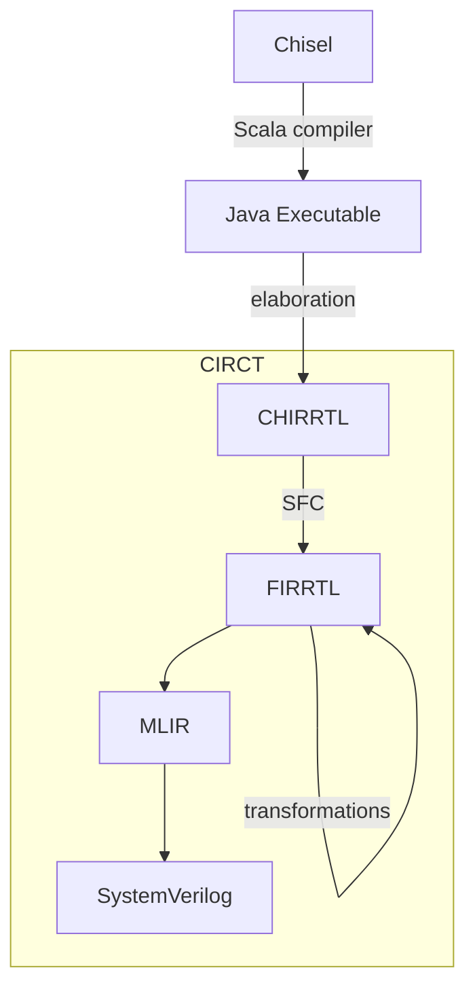

# Rewrite FPROSoC in Chisel

## Chisel

Chisel is technically not a new language but a library written in and for Scala, more exactly it is domain specific language (DSL) for describing hardware circuits embedded in Scala, but given it's extensions it provides on top of Scala it's often described as open-source hardware description language.

### Hardware construction language

In the early days, scripting languages like Perl and Python were used to generate VHDL/Verilog code (sometimes from excel spreadsheets), but the problem with such generators were that they worked on strings, without real understanding (typification) of ingested/generated code. SystemVerilog tried to migrate the this by offering some generational constructs (`#(parameter N=4)`, `generate`) and even some high level constructs like classes that are only available for verification (are typically not synthesizable).

Chisel is actually hardware construction language, that allows us to write hardware generators instead of describing hardware directly. Because it uses Scala each module can be parametrized as any Scala class (using various parameters and generics) and then use those arguments for "generation" using Scala loops or even higher order functions. To understand how and why this works, we will take a look in Chisel to Verilog compilation.

### Chisel to Verilog



#### Compilation

Chisel gets compiled (as Scala) to JVM, which is then executed (this is usually done by `sbt run` command).

#### Elaboration

Is execution on Chisel compiled program, which during construction of `Top` class (and it's subsequent classes) add hardware AST (CHIRRTL) to `ChiselStage`. Each `Module` class gets compiled separately (and it will get lowered into separate SystemVerilog module). Other classes are inlined into first parent `Module` class. This part does hardware generation, from parametrized constructs to concrete hardware AST (modules). Each iteration of loops just adds more hardware AST nodes to stage.

#### Circuit IR Compilers and Tools

Scala FIRRTL (SFC) lowers CHIRRTL to FIRRTL, on which FIRRTL compilers apply some transformations (optimizations; ex: for unused signals) and lower it to MLIR that get optimized further and compiled into targeted language (usually SystemVerilog).

## Design flow in Chisel

Chisel is board independent, it generates SystemVerilog that is later to be consumed by other FPGA tools (in our case Vivaldo) to generate bitstream for board.

Firstly, I imported all files from vaja6 into template Chisel tree (under resource directory), this way all sources are in one place (single source of truth). Secondly, I created `BlackBox` for Top.sv file. `BlackBox` are like header files in C, they only define interface/signature not actual implementation and are not type checked (mismatch between Verilog and Chisel `BlackBox` will cause error in simulation/synthesis if you are lucky). Lastly I setup `ChiselStage` to emit SystemVerilog files into target_sv directory.

```scala
class Top extends BlackBox with HasBlackBoxResource {
  val io = IO(new Bundle {
    // in blackbox we need to explicitly provide clock&reset
    val clock = Input(Clock())
    val reset = Input(Reset())
    val sw = Input(UInt(16.W))
    val led = Output(UInt(16.W))
    val anode_assert = Output(UInt(8.W))
    val segs = Output(UInt(7.W))
  })
  // will copy resource files into target_sv
  addResource("/top.sv")
  addResource("/mcs_bridge.sv")
  addResource("/mmio_controller.sv")
  addResource("/mmio_cores.sv")
  addResource("/mmio_subsystem.sv")
}

object Top extends App {
  ChiselStage.emitSystemVerilogFile(
    new Top,
    Array("--split-verilog", "--target-dir", "target_sv/"),
    firtoolOpts = Array("-disable-all-randomization", "-strip-debug-info")
  )
}
```

Now if we run `sbt run` Chisel/Scala gets compiled, elaborated and lowered into SystemVerilog files that are located in target_sv. This folder can now be loaded into vivaldo project as sources folder (make sure that "copy to project" is not checked). Then we simply associate ELF file and generate bitstream and test on the board.

Using top-down approach we can incrementally rewrite Modules into Chisel and/or blackbox them. Then regenerate bitstream and retest, this way we know we did not break anything in this step of rewriting. We can also write tests in Chisel for modules to ensure no behavior changes (it make sense to write test for blackboxes and later when doing rewrite we expect that tests will still pass). Test are run using `sbt test` and they require verilator to be installed (WSL on Windows).

For `Top` class we need to change it from `BlackBox` to `Module`, then create blackboxes for all of it's children (`microblaze_mcs_0`, `mcs_bridge`, `mmio_subsystem`) and write actual Chisel implementation of `Top` (which is mostly just connecting wires between it's children) and finally remove Top.sv file from resources.

## Verilog -> Chisel

### Modules

Let's look at concrete examples:

```verilog
module M
#(
    parameter ARG = 32'hc000_0000  
)
(
    input logic clock,
    input logic reset,

    input logic inn,
    input logic [31:0] inn_,
    input logic [63:0][31:0] inn_arr, // Packed array
    // Chisel does not support unpacked arrays: [31:0] inn_arr [63:0]

    output logic out,
    output logic [31:0] out_,
    output logic [63:0][31:0] out_arr,
);
//...
endmodule
```

```scala
// whole class definition is actually class constructor
class M(ARG: Log = 0xc000_0000L) extends Module {
    require(ARG > 0) // assert assumptions
    // Module has implicit clock&reset signals while BlackBox has not
    /*
    val clock = Input(Clock())
    val reset = Input(Reset())
    */

    // all IO connections are typically joined in IO Bundle
    val io = IO(new Bundle {
        val inn = Input(Bool())
        val inn_ = Input(UInt(32.W/*idth*/)) // common pitfall: [31:0] has width of 32 not 31
        val inn_arr = Input(Vec(64, UInt(32.W)))
        // To consider vectors as packed arrays instead of scalarized inputs
        // the following options are needed to be passed to firtool:
        // -preserve-aggregate=all -scalarize-public-modules=false -scalarize-ext-modules=false

        val out = Output(Bool())
        val out_ = Output(UInt(32.W))
        val out_arr = Output(Vec(64, UInt(32.W)))
    })
    // ...
}
```

then for instantiation:

```verilog
M m (
    .inn     (_inn),
    .inn_    (_inn_),
    .inn_arr (_inn_arr),
    .out     (_out),
    .out_    (_out_),
    .out_arr (_out_arr),
);
```

```scala
val m = Module(new M)
// implicit clock&reset signals are automatically connected
/*
m.clock <> clock
m.reset <> reset
*/
m.io.inn <> _inn
m.io.inn_ <> _inn_
m.io.inn_arr <> _inn_arr
m.io.out <> _out
m.io.out_ <> _out_
m.io.out_arr <> _out_arr
// or if we use :=
m.io.inn := _inn
m.io.inn_ := _inn_
m.io.inn_arr := _inn_arr
_out := m.io.out
_out_ := m.io.out_
_out_arr := m.io.out_arr
```

### `=`,`:=`,`<>` !#?

- `=` is Scala assignment (evaluated at elaboration time)

- `:=` is Chisel (directional) assignment that wires the **input** of LHS to the **output** of the RHS that will produce `<=` or `assign =` depending on the context

- `<>` is Chisel connection operator, that generally gets compiled down to Verilog's `assign =`

### `Data` classes

All Chisel types have `Data` for superclass. Every `Data` class can be represented as a bit vector in a hardware design.

#### `Bool`

`Bool()` represents single bit that can be `true.B` or `false.B`. Chisel does not support Z or X states.

#### `UInt` type

`value.U(width.W)`

```scala
0xA0.U(16.W) // this can be problematic if we overflow Scala integer
"hA0".U(16.W) // so string literals are preferred
```

##### slices

| Verilog | Chisel |
|---------|--------|
| `a[15]` | `a(15)`|
|`a[32:16]`| `a(32,16)`|

##### slice assignment

Chisel does not support slice/subword assignment, but that limitation can be bypassed by conCATenation:

```scala
val data = 0.U(8.W) // 0b0000_0000
val ones = chisel3.util.Fill(4, 1.U) // 0b1111
val data2 = chisel3.util.Cat(data, ones).U(8.W) // 0b0000_1111
val data22 = chisel3.util.Cat(data(7,4), ones) // 0b0000_1111
```

or by transmuting to `Vec` or `Bundle`. The reason for this is that subword assignment generally hints at a better abstraction with an aggregate/structured types.

#### `Vec`tors

`Vec`tors are like arrays. They have fixed size of same type/size elements. This restriction is relaxed in `MixedVec`

#### `Bundle`s

Are like `struct` in C, they group together several named fields. This is mostly used to group ports (module inputs/outputs) into Bundles.

### "Variables"

Any local constant `localparam a = 5` can be defined as normal Scala value `val a = 5`.

### `logic`

There is no concept of `logic` because everything needs to be typed, so you need to use reg or wire explicitly:

| Verilog | Chisel |
|---------|--------|
| `logic a;` | / |
|`wire a;`| `val a = Wire(/*type*/)`|
|`reg a;`| `val a = Reg(/*type*/)`|
|| `val a = RegInit(reset_value)`|
|| `val a = RegNext(next_value, reset_value)`|

### `RegInit`

```scala
val r = RegInit(0.U(32.W)) // NOTE: implicit clock&reset
// Chisel will automatically put reg assignments into always_ff block
// that is by default run on positive edge
r := 1.U
r := 2.U // last assignments wins
```

we can manually rewrite as

```scala
val r = Reg(UInt(32.W)) // NOTE: implicit clock
r := 1.U
// when cannot use Scala's if as those are evaluated at elaboration (are equal to Verilog's `generate if`)
when(reset) { // will add special HW AST that will emit if in Verilog
  r := 0.U
}.otherwise {
  r := 1.U // redundant
}
```

gets lowered to

```verilog
reg [31:0] r;
always @(posedge clock) begin
  if (reset)
    r <= 0;
  else
    r <= 1;
end
```

### `chisel3.util.Counter`

```scala
val (count: UInt, wrap: Bool) = Counter(0 until 40000, enabled, reset)
```

### Switch

```scala
io.segs := "b11111111".U // default
switch(digit) {
  is("b0000".U) { io.segs := "b1000000".U } // 0
  is("b0001".U) { io.segs := "b1111001".U } // 1
  is("b0010".U) { io.segs := "b0100100".U } // 2
  is("b0011".U) { io.segs := "b0110000".U } // 3
  is("b0100".U) { io.segs := "b0011001".U } // 4
  is("b0101".U) { io.segs := "b0010010".U } // 5
  is("b0110".U) { io.segs := "b0000010".U } // 6
  is("b0111".U) { io.segs := "b1111000".U } // 7
  is("b1000".U) { io.segs := "b0000000".U } // 8
  is("b1001".U) { io.segs := "b0010000".U } // 9
  is("b1010".U) { io.segs := "b0001000".U } // A
  is("b1011".U) { io.segs := "b0000011".U } // b
  is("b1100".U) { io.segs := "b1000110".U } // C
  is("b1101".U) { io.segs := "b0100001".U } // d
  is("b1110".U) { io.segs := "b0000110".U } // E
  is("b1111".U) { io.segs := "b0001110".U } // F
}
```

```verilog
case (digit)
  4'b0000: segs = 7'b1000000; // 0
  4'b0001: segs = 7'b1111001; // 1
  4'b0010: segs = 7'b0100100; // 2
  4'b0011: segs = 7'b0110000; // 3
  4'b0100: segs = 7'b0011001; // 4
  4'b0101: segs = 7'b0010010; // 5
  4'b0110: segs = 7'b0000010; // 6
  4'b0111: segs = 7'b1111000; // 7
  4'b1000: segs = 7'b0000000; // 8
  4'b1001: segs = 7'b0010000; // 9
  4'b1010: segs = 7'b0001000; // A
  4'b1011: segs = 7'b0000011; // b
  4'b1100: segs = 7'b1000110; // C
  4'b1101: segs = 7'b0100001; // d
  4'b1110: segs = 7'b0000110; // E
  4'b1111: segs = 7'b0001110; // F
  default: segs = 7'b1111111; // off
endcase
```

### And much more

- `DecoupledIO` bundle with ready-valid interface
- `UIntToOH`&`OHToUInt` for one-hot encoding/decoding
- `Mux1H(sel: Seq[Bool], in: Seq[Data])`
- `ShiftRegister(in: Data, n: Int[, en: Bool]): Data`
- and much more in [Chisel cheatsheet](https://github.com/freechipsproject/chisel-cheatsheet/blob/master/chisel_cheatsheet-3.6.pdf)

## Known chisel problems

- some stuff is badly documented
- unpacked array not supported, but we can use [packed arrays](https://verificationguide.com/systemverilog/systemverilog-packed-and-unpacked-array/) that only require magic options (again bad docs) `scalarize-ext-modules`
- sizes are not really typed (they are checked in elaboration process)
- feature not a bug: all ports/wires need to be connected, one can use `DontCare`

## Know Vivaldo problems

- associate ELF does not work correctly if MCS is not in top module
- vivaldo does not check folder for new files so folder needs to be reimported
- sometimes changes are not detected (generate bitstream uses old files)

### Sources

- <https://www.researchgate.net/publication/383664706_Hardware_Generators_with_Chisel>
- <https://circt.llvm.org/>
- <https://stackoverflow.com/questions/44548198/chisel-code-transformation>
- <https://chipyard.readthedocs.io/en/stable/Tools/index.html>
- <https://chipyard.readthedocs.io/en/stable/Customization/Firrtl-Transforms.html>
- Schoeberl, M. (2019). Digital Design with Chisel. Kindle Direct Publishing
- <https://github.com/freechipsproject/chisel-bootcamp>
- <https://en.wikipedia.org/wiki/SystemVerilog>
